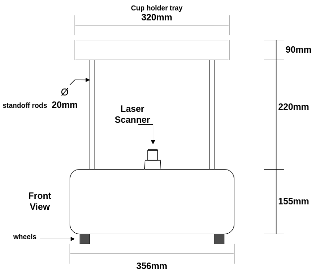

# BaristaBot

A 4-wheeled mobile robot simulation built with **ROS 2 Humble** and **Ignition Fortress**.  
This repo contains all the URDF, xacro, meshes, and launch files needed to bring up the robot in simulation.

---

## Prerequisites

- ROS 2 **Humble**
- Ignition **Fortress**
- Colcon workspace (e.g., `void_ws`)

---

## Clone and Build

### 1. Clone the repository inside your ROS 2 workspace:
```bash
cd ~/void_ws/src
git clone https://github.com/ritwikrohan/BaristaBot.git .
```

### 2. Build the workspace:
```bash
cd ~/void_ws
source /opt/ros/humble/setup.bash
colcon build
source install/setup.bash
```

---

## Launch the Robot in Ignition Fortress

```bash
ros2 launch barista_bot_description barista_urdf.launch.py
```

This will:
- Launch Ignition Fortress
- Spawn the BaristaBot model
- Start publishing joint state and TF from URDF

---

## Folder Structure

- `urdf/`, `xacro/`: Robot model files
- `launch/`: ROS 2 launch files
- `meshes/`: 3D mesh assets
- `worlds/`: Gazebo world files (optional)
- `rviz/`: RViz configurations
- `src/`, `include/`: Source code (if any)
- `barista_robot_drawing.png`: Robot sketch/design reference

---

## Status

- Gazebo Classic support complete  
- Ignition Fortress basic simulation working  
- Isaac Sim integration in progress

---

## Preview



---
