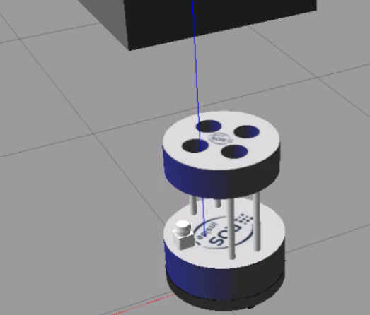
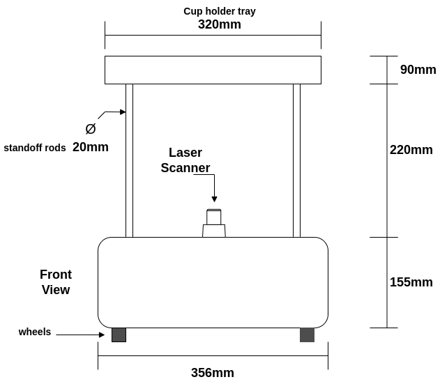

# BaristaBot - Autonomous Coffee Delivery Robot

4-wheeled omnidirectional mobile robot for autonomous coffee delivery with ROS2 Humble and multi-simulator support.

## Overview

BaristaBot is an autonomous service robot designed for coffee shop environments, featuring a custom 4-wheel drive system with omnidirectional caster wheels, integrated cup holder tray, and LiDAR-based navigation. The robot seamlessly operates across Gazebo Classic, Ignition Fortress, and Isaac Sim, providing a robust platform for service robotics research and deployment. Built with modular xacro descriptions and comprehensive sensor integration, it enables rapid prototyping of delivery behaviors in both simulated and real environments.

## Demo

### Simulation Testing - Ignition Fortress
<p align="center">
  
</p>

*BaristaBot navigating autonomously in Ignition Fortress with LiDAR visualization and differential drive control*

### Robot Design Concept
<p align="center">
  
</p>

*Original design sketch showing the 4-wheel configuration with cup holder tray system*

## Key Features

- **Multi-Simulator Support**: Native compatibility with Gazebo Classic, Ignition Fortress, and Isaac Sim
- **Modular Xacro Design**: Parameterized robot description with reusable wheel, standoff, and tray macros
- **Differential Drive Control**: 2-wheel differential drive with omnidirectional caster wheels for smooth navigation
- **LiDAR Integration**: GPU-accelerated LiDAR simulation with 200 samples, 360° coverage
- **Cup Holder System**: Dedicated tray design for stable beverage transport
- **Real-time TF Broadcasting**: Complete kinematic chain with joint state publisher
- **ROS2 Bridge Configuration**: Full sensor and control bridging between Ignition and ROS2

## Performance Metrics

| Metric | Value | Conditions |
|--------|-------|------------|
| Max Linear Velocity | 1.0 m/s | Flat surface |
| Max Angular Velocity | 2.0 rad/s | In-place rotation |
| LiDAR Range | 0.15m - 5.0m | GPU LiDAR sensor |
| LiDAR Update Rate | 10 Hz | 200 samples/scan |
| Wheel Separation | 0.3m | Differential drive base |
| Payload Capacity | 2kg | Cup holder tray |
| Operating Environment | Indoor | Smooth surfaces |

## Technical Stack

- **Framework**: ROS2 Humble
- **Simulation**: Ignition Fortress (primary), Gazebo Classic, Isaac Sim (in progress)
- **Robot Description**: URDF/Xacro with modular macros
- **Control**: Differential drive plugin (gz::sim::systems::DiffDrive)
- **Sensors**: GPU LiDAR (ignition::gazebo::systems::Sensors)
- **Visualization**: RViz2 with custom configuration
- **Bridge**: ros_gz_bridge for Ignition-ROS2 communication
- **Build System**: Colcon with ament_cmake

## Installation

### Prerequisites
```bash
# ROS2 Humble
sudo apt update
sudo apt install ros-humble-desktop-full

# Ignition Fortress
sudo apt install ignition-fortress

# Required ROS2 packages
sudo apt install ros-humble-ros-gz-bridge \
                 ros-humble-ros-gz-sim \
                 ros-humble-xacro \
                 ros-humble-joint-state-publisher \
                 ros-humble-robot-state-publisher

# Gazebo Classic (optional)
sudo apt install ros-humble-gazebo-ros-pkgs
```

### Build from Source
```bash
# Create workspace (if not exists)
mkdir -p ~/void_ws/src
cd ~/void_ws/src

# Clone repository
git clone https://github.com/yourusername/BaristaBot.git

# Build workspace
cd ~/void_ws
source /opt/ros/humble/setup.bash
colcon build --packages-select barista_robot_description
source install/setup.bash
```

## Usage

### Launch in Ignition Fortress
```bash
# Launch complete robot with all bridges and RViz
ros2 launch barista_robot_description barista_urdf.launch.py
```

### Launch in Gazebo Classic (Alternative)
```bash
# Launch with Gazebo Classic instead
ros2 launch barista_robot_description barista_xacro.launch.py
```

### Control the Robot
```bash
# Teleop control (install if needed: sudo apt install ros-humble-teleop-twist-keyboard)
ros2 run teleop_twist_keyboard teleop_twist_keyboard

# OR publish velocity commands directly
ros2 topic pub /cmd_vel geometry_msgs/msg/Twist "{linear: {x: 0.5}, angular: {z: 0.5}}"
```

### Monitor Sensors
```bash
# View LiDAR data
ros2 topic echo /scan

# Check odometry
ros2 topic echo /odom

# Monitor joint states
ros2 topic echo /joint_states

# Visualize TF tree
ros2 run tf2_tools view_frames
```

## Repository Structure

```
BaristaBot/
├── launch/                      # Launch files for different simulators
│   ├── barista_urdf.launch.py  # Ignition Fortress launcher
│   └── barista_xacro.launch.py # Gazebo Classic launcher
├── urdf/                        # Complete URDF descriptions
│   └── barista_robot_model.urdf
├── xacro/                       # Modular xacro components
│   ├── barista_robot_model.urdf.xacro  # Main robot description
│   ├── wheel.xacro             # Wheel macro with inertial properties
│   ├── standoff.xacro          # Support rod macro
│   └── cup_holder_tray.xacro   # Cup holder tray macro
├── meshes/                      # 3D model assets
│   └── sick_s300.stl           # LiDAR sensor mesh
├── rviz/                        # RViz configurations
│   └── config.rviz             # Pre-configured visualization
├── worlds/                      # Simulation environments
│   └── empty.world             # Basic world file
├── images/                      # Documentation images [Add your images here]
│   ├── baristabot_ignition_demo.gif
│   └── baristabot_rviz.png
├── CMakeLists.txt              # Build configuration
├── package.xml                 # Package dependencies
└── barista_robot_drawing.png  # Design reference

```

## Technical Implementation

### Xacro Macro System
1. **Wheel Macro**: Parameterized wheel generation with automatic inertial calculation
2. **Standoff Macro**: Configurable support rods with variable length/radius
3. **Cup Holder Macro**: Modular tray system with cylinder inertia computation
4. **Conditional Components**: Laser sensor inclusion via xacro parameters

### Differential Drive Architecture
- **Drive Wheels**: Left/right continuous joints with high friction coefficients
- **Caster Wheels**: Front/back omnidirectional supports with 3-DOF (yaw, roll, pitch)
- **Control Plugin**: Native Ignition differential drive with odometry publishing
- **Wheel Parameters**: 0.0352m radius, 0.3m separation, 0.0206m width

### Sensor Integration Pipeline
1. **GPU LiDAR**: Hardware-accelerated ray tracing in Ignition
2. **Joint States**: Real-time position/velocity feedback from all joints
3. **Odometry**: Fused wheel encoder odometry with TF broadcasting
4. **ROS2 Bridge**: Bidirectional communication for all sensor/control topics

### Multi-Simulator Approach
- **Gazebo Classic**: Legacy support with gazebo_ros plugins
- **Ignition Fortress**: Primary platform with native gz-sim plugins  
- **Isaac Sim**: Migration in progress for photorealistic simulation
- **Plugin Abstraction**: Simulator-agnostic xacro descriptions

## Future Enhancements

- [ ] Nav2 integration for autonomous navigation
- [ ] Multi-floor elevator interaction
- [ ] Dynamic obstacle avoidance with costmap layers
- [ ] Coffee shop semantic mapping
- [ ] Human-aware social navigation
- [ ] Battery management simulation
- [ ] Manipulator arm for door opening
- [ ] Cloud-based fleet management

## Troubleshooting

### Common Issues

1. **Meshes not loading**: Update mesh path in xacro files:
   ```xml
   <mesh filename="$(find barista_robot_description)/meshes/sick_s300.stl"/>
   ```

2. **Bridge topics not appearing**: Ensure ros_gz_bridge is installed:
   ```bash
   sudo apt install ros-humble-ros-gz-bridge
   ```

3. **Robot falling through ground**: Check collision geometries and friction coefficients

4. **LiDAR not publishing**: Verify GPU drivers and Ignition Sensors plugin

## Contributing

Contributions are welcome! Please feel free to submit pull requests or open issues for bugs and feature requests.

## License

This project is currently under development. License TBD.

## Contact

**Ritwik Rohan**  
Robotics Engineer | Johns Hopkins MSE '25  
Email: ritwikrohan7@gmail.com  
LinkedIn: [linkedin.com/in/ritwik-rohan](https://linkedin.com/in/ritwik-rohan)

---
